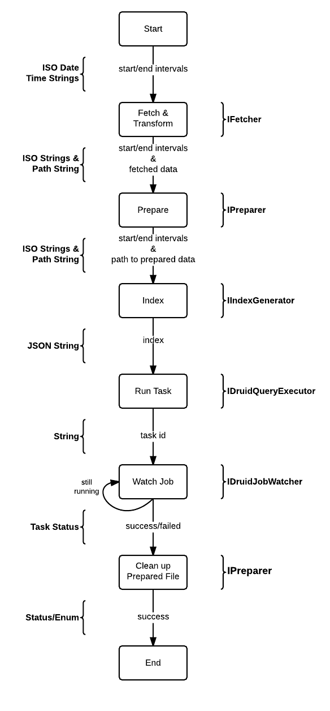
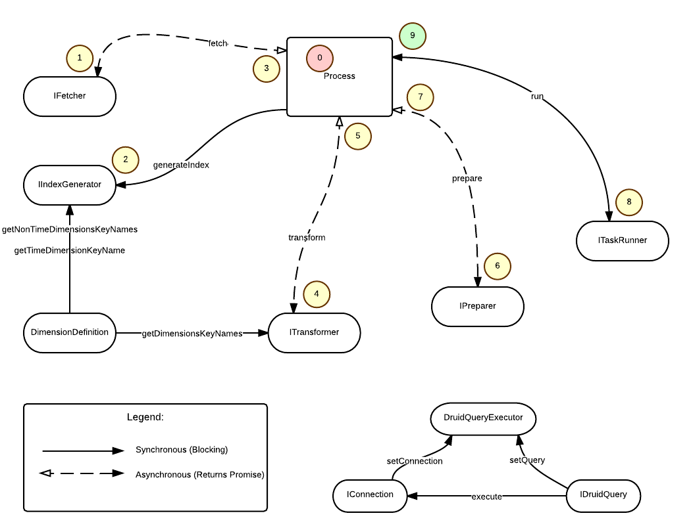

php-druid-ingest
===============

Experimental PHP wrapper around querying [Druid](http://druid.io).

Overview
---------------

The wrapper lives in the namespace `PhpDruidIngest`.

The plan for this is to contain tasks related to the extraction, transformation, and loading of data from
other sources into druid. This involves the ETL of that data, the generation of a compatible Druid indexing task, and
the execution and subsequent monitoring of indexing task, and removal of data.

The idea is that this guy lives on the Druid node that will ingest the data, or will have a way to move the file
from itself to the destination Node (say via `scp`).


Design
---------------

This is totally _work in progress_ and _subject to change_. Please refer to this diagram for an overview of how this works underneath the hood.



(From this [Dynamic LucidChart Source URL](https://www.lucidchart.com/publicSegments/view/5418b6c7-f4c4-479c-9696-4e1a0a004a03/image.png))


Let's walk through this in a couple scenarios, noting the two parallel tracks that meet together before submission
to Druid.

1) Referral report
    fetch/MySQL Query   ->  transform   ->  <none>      ->  load/runTask
    generate index      -------------------------------/

2) Auction House
    fetch/HTTP GET      ->  transform   ->  <none>      ->  load/runTask
    generate index      -------------------------------/

3) Auction House Remote
    fetch/HTTP GET      ->  transform   ->  scp         ->  load/runTask
    generate index      -------------------------------/

4) Storm
    storm topology      ->  transform   ->  prepare     ->  load/runTask
    generate index      -------------------------------/

5) MapReduce
    map/reduce job      ->  transform   ->  prepare     ->  load/runTask
    generate index      -------------------------------/


Making the following steps:
    fetch               ->  transform   ->  prepare     ->  load/runTask
    generate index      -------------------------------/


With the following classes taking on the work:
    IFetcher            ->  IFetcher    ->  IPreparer   ->  ITaskRunner
    IIndexGenerator     -------------------------------/


IF we wanted to split this work out further to be more modular:
    IFetcher            ->  ITransformer->  IPreparer   ->  ITaskRunner
    IIndexGenerator     -------------------------------/


Resulting in these classes. Sketch of their interfaces:

IFetcher
    +fetch
    +handleFetchedResult

ITransformer
    +transform (needs data from IFetcher fetch)
    +handleTransformedResult

IPreparer
    +prepare
    +prepared

ITaskRunner
    +run (needs IPreprarer to have finished and to have index from IIndexGenerator generateIndex)

IIndexGenerator
    +generateIndex (needs path from IPreparer prepare)

DimensionDefinition
    +getDimensionsKeyNames
    +getNonTimeDimensionsKeyNames
    +getTimeDimensionKeyName


Looking at how these interfaces fit together:



(From this [Dynamic LucidChart Source URL](https://www.lucidchart.com/publicSegments/view/5418b736-2484-45e5-af7c-79100a00d7bd/image.png))


How to Test
-------------

From the root directory, in a command terminal run: `php vendor/phpunit/phpunit/phpunit tests`.


How to Install
---------------

Right now, there is no tagged version.

- Stable branch: `dev-master`
- Cutting edge: `dev-develop`

To install, it is suggested to use [Composer](http://getcomposer.org). If you have it installed, then the following instructions
in a composer.json should be all you need to get started:

```json
{
    "minimum-stability": "dev",
    "repositories": [
        {
            "type": "vcs",
            "url": "git@github.com:r4j4h/php-druid-ingest"
        }
    ],
    "require": {
        "r4j4h/php-druid-query": "dev-master"
    }
}
```

Once that is in, `composer install` and `composer update` should work.

Once those are run, require Composer's autoloader and you are off to the races:

1. `require 'vendor/autoload.php';`


References
---------------

- [Druid](http://druid.io)
- [Composer](http://getcomposer.org)
- [Guzzle](http://guzzle.readthedocs.org)


Appendix A. Composer.json example that does not rely on Packagist.org:
---------------

```json
{
    "minimum-stability": "dev",
    "repositories": [
        {
            "type": "vcs",
            "url": "git@github.com:r4j4h/php-druid-ingest"
        }
    ],
    "require": {
        "r4j4h/php-druid-query": "dev-master"
    }
}
```
